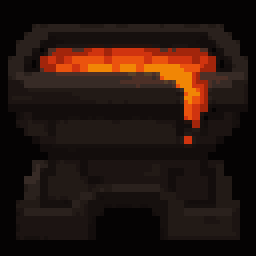

# Fornax



Fornax is a rendering engine for Minecraft: it controls how a scene is actually drawn to the
screen. It runs as a companion mod to Sodium, Minecraft's Vulkan-based renderer, through the Fabric
mod loader (Vulkan is the graphics interface Sodium uses to talk to the graphics card; Fabric is
the system that lets separate mods load together). On top of Sodium, Fornax adds LabPBR terrain
material sampling (a texture format that encodes how rough or reflective a block's surface is),
screen-space ambient occlusion (soft shadowing in corners and creases), temporal anti-aliasing
(edge smoothing that uses information from previous frames), screen-space reflections, and
supersampling anti-aliasing.

None of that visual style lives inside Fornax. It comes from a shaderpack: a folder placed under
`shaderpacks/` describing a look as a graph of rendering steps, a set of adjustable options, and the
settings screen that exposes them.

Fornax's own job is to read and run that folder, with no rendering pipeline of its own built in.
Install Fornax alone, with no pack, and Minecraft renders as plain vanilla Sodium.

**The pack format is Fornax's own.** It is not compatible with packs written for other loaders, and
they are not compatible with it. A pack is plain-text TOML plus GLSL;
[docs/PACK-FORMAT.md](docs/PACK-FORMAT.md) is the manual for writing one.

## Requirements

- Minecraft 26.2
- Fabric Loader >= 0.19.2
- Sodium 0.9.1 or 0.9.2 for Minecraft 26.2. Fabric Loader enforces this at launch and will refuse
  to start on a version outside that range. Tested against 0.9.1 and 0.9.2-alpha.4.
- Java 25 or newer
- `--enable-native-access=ALL-UNNAMED` in the launcher JVM arguments, required by MetalFX's Java
  FFM bridge. Without it, Java 25 prints the JEP 472 restricted-native-access warning now, and will
  refuse to start on a future JDK.

## Building

```
./gradlew build
```

## Documentation

See [docs/ARCHITECTURE.md](docs/ARCHITECTURE.md) for internals.

## Releasing

Version numbers live in `mod_version` in `gradle.properties`; tagging `v<that version>` cuts a
release. [docs/RELEASING.md](docs/RELEASING.md) has the process.
